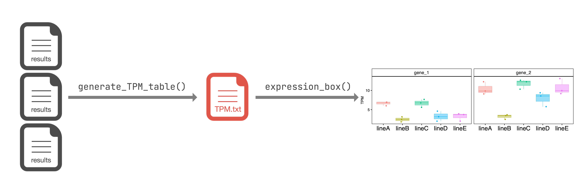

# expression.box : an R package for visualizing gene expression level

## What is it?
`expression.box` generates boxplot from read count data output by [RSEM](https://github.com/deweylab/RSEM) (.result file). 
`expression.box` contains 2 main functions: `generate_TPM_table()` and `expression_box()`. 
Using them, you can easily visualize the expression levels of the genes you are interested in.



This package was originally developed for members of Weed Science lab of Kyoto University.

## Installation
You need `devtools` for the installation of `expression.box`. 
If you don't have `devtools`, you can install it from CRAN:

```R
install.packages('devtools')
```

You can install `expression.box`:

```R
devtools::install_github('Hinata-Ishizawa/expression.box')
```

## Usage
### Data formatting
Run `generate_TPM_table()` to extract the required information from .results files. The only parameter of this function is `directory_path`, that is the path to .results files [default: 'result']. 
For example, if you put your files as below,

```
|-- WorkingDirectory/
|   |-- result/
|   |   |-- expample1.results
|   |   |-- expample2.results
|   |   |-- expample3.results
|   |   |-- ...
```

simply run:

```R
generate_TPM_table()
```

Optionally, if you want to do the analysis using expected_count, you can run `generate_exp_table()` to extract requred information. 
`generate_both_table()` would be useful if you want to create both table.

### Createing boxplot
`expression_box()` creates boxplot from TPM.txt created by `generate_TPM_table()`. The parameters of this function are:
- `file_path`: The path to 'TPM.txt'. Default is 'TPM.txt'.
- `gene_set`: Gene ID of genes you are interested in.
- `sample`: Sample names.
- `replication`: Number of reprications of each sample.
- `pal`: Color pallet for boxplot. Default is 'NULL'.

If you want to only formatting TPM data for creating boxplot and create it yourself, you can use `data_arange()`.
